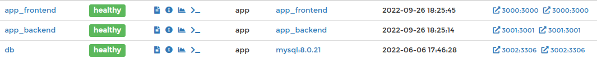

# Project Trybe Futebol Clube

O TFC é um projeto que mostra partidas de futebol

  
<strong>⚠️ Como rodar o projeto:</strong>
 

Na sua máquina você deve ter:
	
 - Sistema Operacional Distribuição Unix
 - Node versão 16  
 - Docker
 - Docker-compose versão 1.29.2
 
Na Raiz do projeto instale as dependencias:
	
	npm install
	
Logo apos suba os containers:
	
	npm run compose:up
	
	
	

Depois so acessar http://localhost:3000/login e fazer o login:
	
	Login: admin@admin.com
	Senha: secret_admin 

